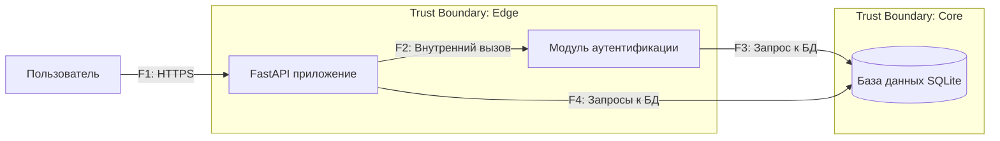

# DFD — Data Flow Diagram для Study Notes

## Контекстная диаграмма (Mermaid)

## Список потоков
| ID | Откуда → Куда | Канал/Протокол | Данные/PII | Комментарий |
|----|---------------|-----------------|------------|-------------|
| F1 | Пользователь → FastAPI приложение	| HTTPS	| Учетные данные, заметки	| Пользователь взаимодействует с API через браузер |
| F2 | FastAPI приложение → Модуль аутентификации	| Внутренний вызов	| Токены, идентификатор пользователя	| Внутренняя коммуникация между компонентами |
| F3 |	Модуль аутентификации → База данных	| SQL запрос	| Хэши паролей, данные пользователя	| Проверка учетных данных |
| F4 |	FastAPI приложение → База данных	| SQL запрос	| Заметки, теги, метаданные	| CRUD операции с заметками |
